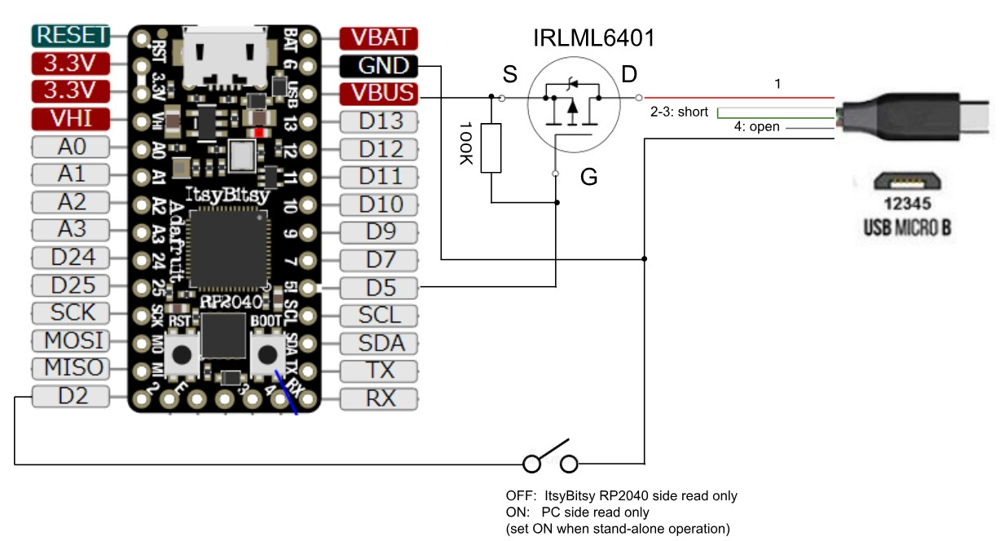

# Intemittent Charger

## Overview
This is Intermittent Charger

This project features:
* Periodic charging ON/OFF control
* Configurable ON/OFF term from Serial I/F

## Supported Board
* ItsyBitsy RP2040 board

## Pin Assignment
### ST7735S 80x160 LCD (Waveshare RP2040-LCD-0.96 Board)

| Pin # | Pin Name | Function | Signal Name | Description |
----|----|----|----|----
|D5 | GPIO14 | GPIO | PwrOff | 0: Power ON, 1: Power OFF |
|D2 | GPIO12 | GPIO | ReadonlySwitch | 0: Filesystem R/W from the board / Read-only from PC,  open: Filesystem R/W from PC / Read-only from the board |

## Schematic



## How to build
* Program adafruit-circuitpython-adafruit_itsybitsy_rp2040-xxxx.uf2 from [CircuitPython ItsyBitsy RP2040](https://circuitpython.org/board/adafruit_itsybitsy_rp2040/)
(Confirmed with `adafruit-circuitpython-adafruit_itsybitsy_rp2040-en_US-9.2.4.uf2`)
* If you've already connected the circuit in the schematic, open the switch connected with D2.
* Put code.py, config.py and boot.py on CircuitPython drive

## Usage
Serial command through serial terminal connected to USB
* '+' or '=': increase ON time
* '-': decrease ON time
* 'u': increase OFF time
* 'd': decrease OFF time
* 'o': immediate ON
* 'x': immediate OFF

(When operation, close the switch (connected with D2) to give rewrite permission for config.py)

## Note
* Edit boot.py very carefully if you need, otherwise the device could be locked with readonly from PC with wrong settings. In case that the device has been locked by mis-operation, you will be able to delete boot.py by following so that you can start over with read-write mode from PC.
```
>>> import storage
>>> storage.erase_filesystem()
```

